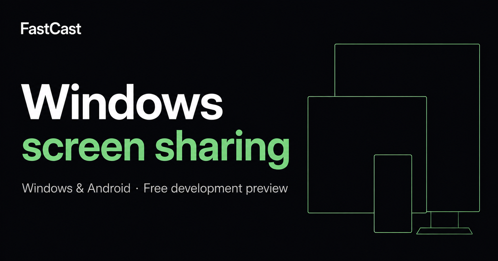

  

  
<strong>Screen sharing for Windows and Android.</strong> 
  Stream a Windows screen or window to another Windows PC, Android phone, or tablet.

  

    <a href="https://antis0007.github.io/fastcast-downloads/downloads.html"><strong>Download the development preview →</strong></a>
    &nbsp;&nbsp;·&nbsp;&nbsp;
    <a href="https://antis0007.github.io/fastcast-downloads/"><strong>Visit the website</strong></a>
    &nbsp;&nbsp;·&nbsp;&nbsp;
    <a href="https://antis0007.github.io/fastcast-downloads/help.html"><strong>Help</strong></a>
  

FastCast is a free development-preview screen-sharing app. Matching Windows and Android packages are published here. There are no subscriptions in the current offer. This repository holds the public website and release assets, not the native application source.

> [!IMPORTANT]
> Use matching app versions. The supported testing path is a Windows sender and an Android or Windows receiver on the same LAN, or another reachable private network. Managed relay is not implemented. Windows installers are unsigned; Android packages are debug-signed.

## Install the preview

1. Open the [downloads page](https://antis0007.github.io/fastcast-downloads/downloads.html) or the [latest release](https://github.com/antis0007/fastcast-downloads/releases).
2. On Windows, run `FastCast-<version>-Setup.exe`.
3. On Android 8 or newer, install `FastCast-<version>-Android.apk` and allow installation from that source.
4. Follow [getting started](https://antis0007.github.io/fastcast-downloads/get-started.html) so both devices stay on the same version.

A portable ZIP with both apps is also published on each release.

## Website maintenance

The website is static HTML, CSS, and optional JavaScript. Navigation, direct downloads, screenshot links, and FAQs work without JavaScript. There are no runtime dependencies, analytics, external fonts, billing forms, or browser storage.

- Edit page bodies in `src/pages/` and shared navigation, brand chrome, and metadata in `scripts/build-site.py`.
- Keep verified public release links in `src/release.json`. Do not point to an unpublished version.
- Run `npm run build` with Python 3 installed and commit the generated root HTML, sitemap, and robots file alongside their sources. GitHub Pages serves those root files without a server build.
- Development checks: `npm ci`, `npx playwright install chromium firefox webkit`, `npm run check`, `python scripts/check-links.py`, and `npm test`.
- Browser checks cover all fourteen pages at four widths, enlarged text, image loading, no-JavaScript access, keyboard image dismissal, help search, Android download selection, calculator interactions, and automated accessibility. They do not qualify native streaming.

## Screenshots and claims

The native Windows captures use the app's default Cyan theme and were taken from the September 7, 2026 appearance-review executable. They capture the client area directly, excluding the operating-system title bar. They are unchanged captures of a development interface newer than the public preview. The social preview card and header/footer artwork are generated brand graphics; they are not product screenshots.

Read DESIGN.md for the visual direction and pre-commit critical review. Future collaboration work is identified as future work. Do not fabricate conversations, metrics, testimonials, security guarantees, or feature parity with other communication apps.

## Release and feedback policy

Use matching app versions and consult the published release notes. Keep invitations, recovery codes, and private screen content out of public issues. Issue templates collect reproduction details and user needs without opening a ticket automatically.
